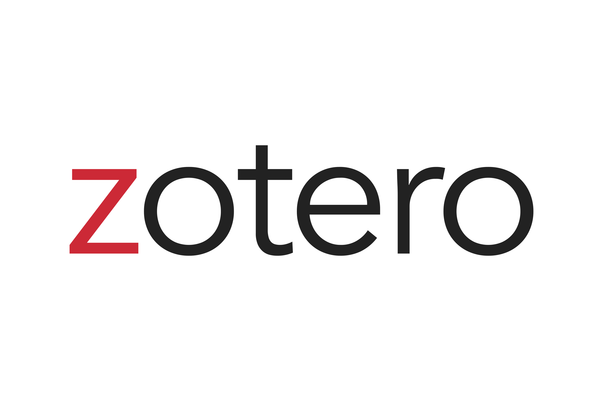
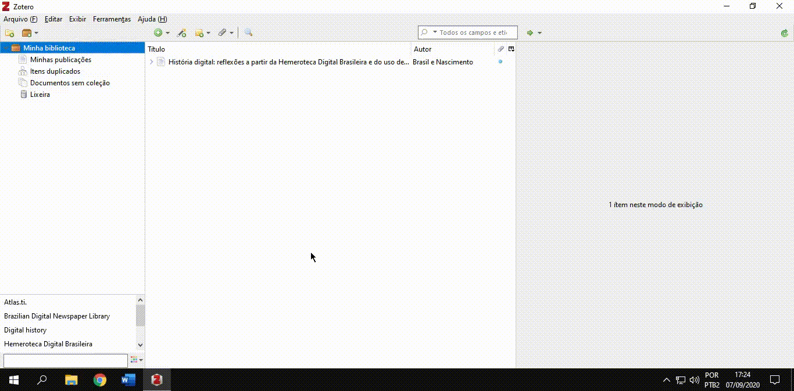
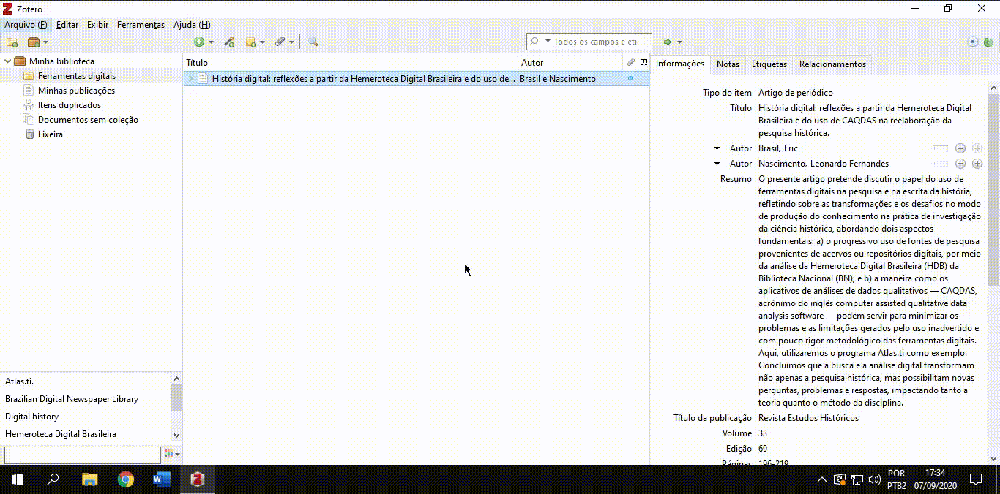
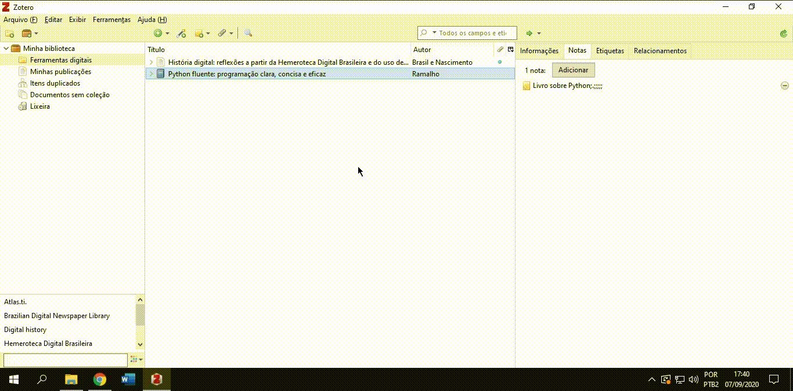
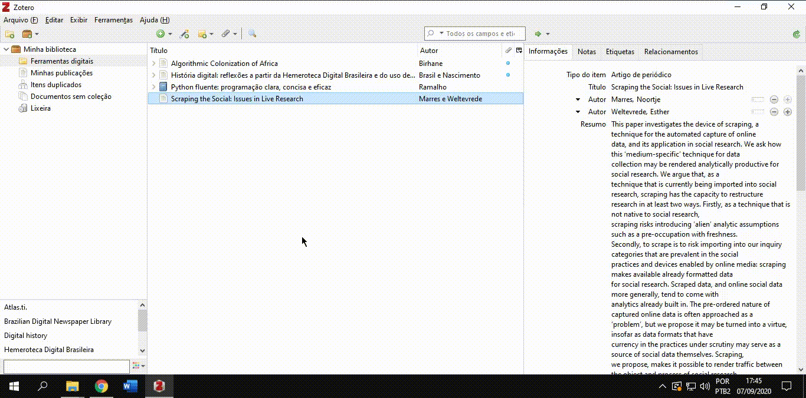
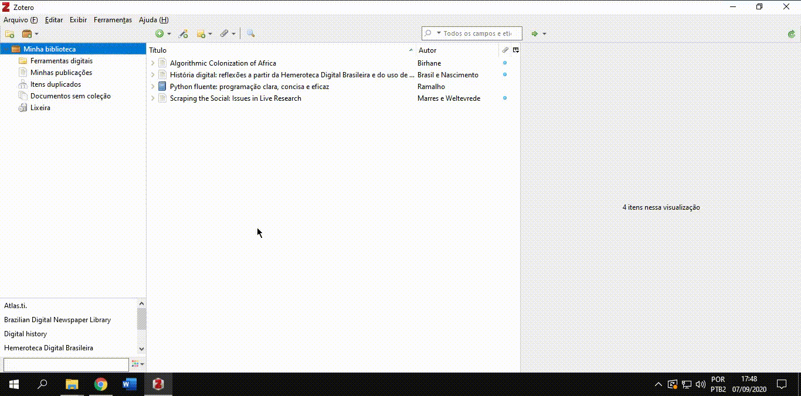
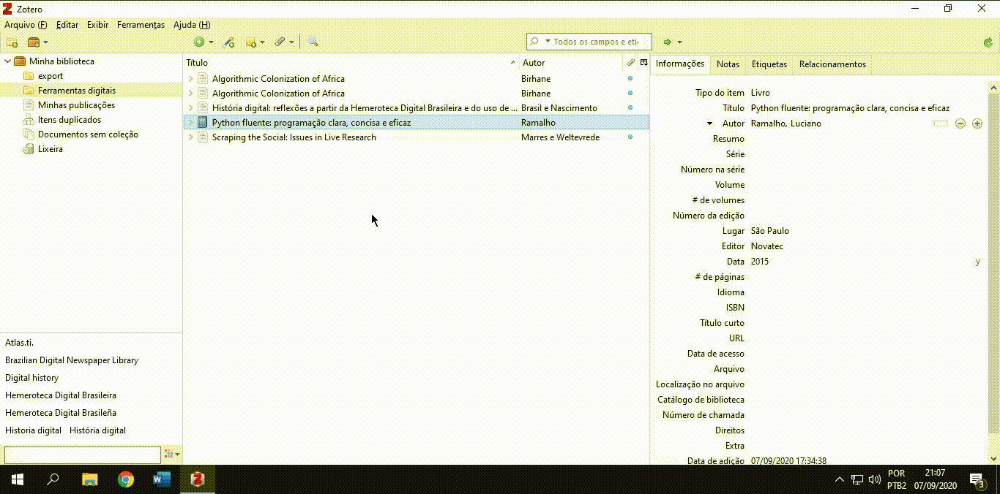
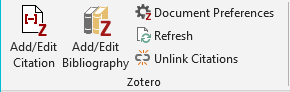
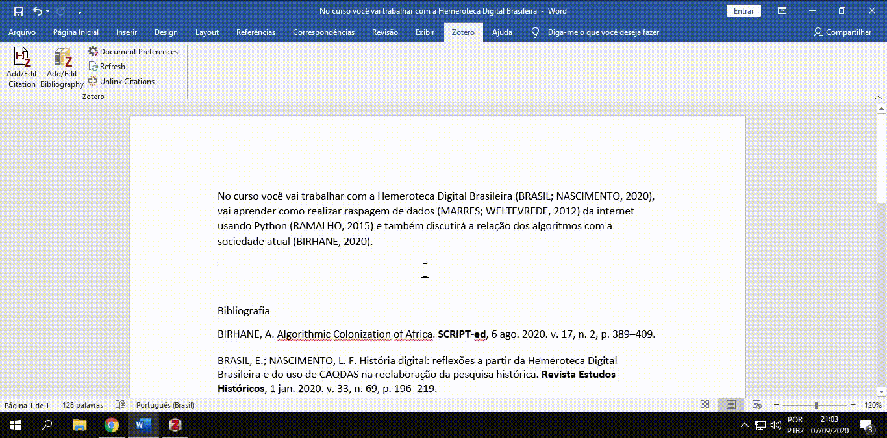

# Aula síncrona 3 - Workshop de Zotero

Professor [_Eric Brasil_](https://ericbrasiln.github.io)

---

**Ferramentas digitais e a pesquisa em humanidades**

**Instituto de Humanidades e Letras, campus dos Malês, Universidade da Integração Internacional da Lusofonia Afro-brasileira (UNILAB)**

**Data**: 08 de setembro de 2020

**Carga Horária**: 1h

**Horário**: 19h às 20h

---

## Índice

- [Apresentação](#apresentação-pra-que-serve-o-zotero)
- [Download, instalação, criação de conta e uso da extensão no Google Chrome](#download-instalação-criação-de-conta-e-uso-da-extensão-no-google-chrome)
- [Visão geral do software](#visão-geral-do-software)
- [Configuração inicial](#configuração-inicial-preferências)
    - [Citação](#citação)
        - [Estilos](#estilos)
        - [Processadores de texto](#processadores-de-texto)
- [Ferramentas básicas](#ferramentas-básicas)
    - [Nova Coleção](#nova-coleção)
    - [Novo Item](#novo-item)
    - [Varinha Mágica](#varinha-mágica)
    - [Nova Nota](#nova-nota)
    - [Adicionar Anexo](#adicionar-anexo)
    - [Busca Avançada](#busca-avançada)
    - [Etiquetas](#etiquetas)
    - [Importar pesquisas de bases de dados on-line](#importar-pesquisas-de-bases-de-dados-on-line)
    - [Importar referências RIS](#importar-referencias-ris)
- [Utilizando a extensão do Zotero em seu editor de texto](#utilizando-a-extensão-do-zotero-em-seu-editor-de-texto)
- [Dica bônus: conectar o Zotero ao Sci-hub](#dica-bônus-conectar-o-zotero-ao-sci-hub)
- [Links úteis](#links-úteis)
- [Licença](#licença)

---

## Apresentação: pra que serve o Zotero?

- Buscar, armazenar e organizar uma biblioteca pessoal de referências;
- Gerar citações e bibliografias em textos acadêmicos e ciêntíficos em diversos estilos de normas;
- Criar notas sobre os textos lidos;
- Compartilhar referências com outros/as pesquisadores/as através de bibliotecas de grupos on-line;
- É um software livre e aberto.

---

## Download, instalação, criação de conta e uso da extensão no Google Chrome

**Zotero do Zero**: ***Tutorial de instalação do Zotero***

---

## Visão geral do _software_

1. **Biblioteca: coleções e grupos** - Coleções de referências (pastas) que podem ser organizadas como você desejar.

2. **Referências**: Lista de referências que estão dentro da coleção (pasta) que foi selecionada.

3. **Informações**: Informações de cada referência, tais como título, autor, ano de publicação,  resumo e etc.

- **OBS**: Os artigos que estão com uma bolinha azul do lado significa que possuem um anexo, como por exemplo o texto completo em PDF.

---

## Configuração inicial: _Preferências_

><small>(Clique nos vídeos para visualizar em nova aba)</small>

### Citação

#### Estilos

>Veja como adicionar estilos de normas específicas para utilizar em suas citações e bibliografia:

---

#### Processadores de texto

>Se a extensão do Zotero não aparece no seu editor de texto, veja aqui como instalá-la pelo próprio programa:

---

## Ferramentas básicas

<small>Clique nos vídeos para visualizar em nova aba</small>

### ***Nova Coleção***

>Crie um nova coleção (pasta) para organizar sua biblioteca:

---

### ***Novo Item***

>Existem várias formas de incluir novos itens em sua biblioteca do Zotero. Aqui vc verá como fazer isso manualmente:

---

### ***Varinha Mágica***

>Com o botão da Varinha Mágica vc pode inserir DOI, ISBN etc e o Zotero busca as informações:

---

### ***Nova Nota***

>As notas podem servir como breves comentários sobre um artigo, ou um fichamento, etc:

---

### ***Adicionar Anexo***

>Muitas vezes inserimos uma referência sem um arquivo PDF. É possível adicionar posteriormente:

---

### ***Busca Avançada***

>Além da busca simples, direto na barra, é possível realizar buscas avançadas com vários parâmetros:

---

### ***Etiquetas***

>As etiquetas funcionam como marcadores ou tags que possibilitam o agrupamento de trabalhos com temáticas equivalentes e sua recuperação:

---

### Importar pesquisas de bases de dados on-line

>É possível salvar resultados de buscas completas em base de dados como _Periódicos Capes, Scopus, PubMed, Web of Science_. O Zotero já cria uma nova coleção (pasta) para o resultado da busca. 
>Aqui veremos o exemplo da base Scielo:

#### [Base Scielo](http://www.scielo.org){:target="_blank"}

### Importar referências RIS

>Também é possível salvar referências em arquivo `.RIS` e importar para o Zotero:

`Arquivo > Importar > Um arquivo(BibTex, RIS...) > Next > Selecione o arquivo`

---

## Utilizando a extensão do Zotero em seu editor de texto

>Esses recursos são fundamentais para o processo de escrita acadêmica e científica. Possibilitam a inserção e edição de citações, atualização dos estilos das normas e a inclusão de bibliografia.

---

---

## Dica bônus: conectar o Zotero ao Sci-hub

>Para que o Zotero tente baixar o PDF da referência desejada utilizando o Sci-hub siga os seguintes passos:

`Preferências > Avançado > Editor de configurações`

>Procure por:

`extensions.zotero.findPDFs.resolvers`

>Clique com o botão direito e depois clique em:

`Modify`

Apague o `[]` e cole o seguinte:

~~~
{
    "name":"Sci-Hub",
    "method":"GET",
    "url":"https://sci-hub.se/{doi}",
    "mode":"html",
    "selector":"#pdf",
    "attribute":"src",
    "automatic":true
}
~~~

---

## Links úteis

- [Manual do Zotero](textos/SIMONINI-zotero.pdf){:target="_blank"}

- [_Capacitação para uso do Zotero_, Biblioteca da UDESC](https://www.youtube.com/watch?v=aJnKjsFCva0){:target="_blank"}

---

## Licença

GNU GENERAL PUBLIC LICENSE v.3.0

Copyright (C) 2020 Eric Brasil

[Voltar para o início](#aula-síncrona-3---workshop-de-zotero)

[Página inicial](https://ericbrasiln.github.io/ferramentas_digitais_UNILAB/){:target="_blank"}
