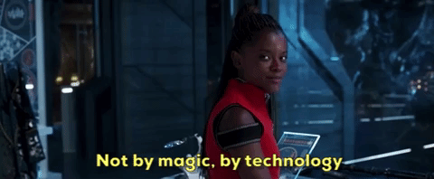
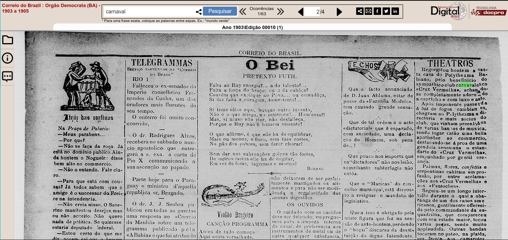
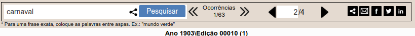

# Aula síncrona 5 - 💻️ Acessando fontes on-line: o caso da Hemeroteca Digital Brasileira – Biblioteca Nacional

Professor [_Eric Brasil_](https://ericbrasiln.github.io){:target="_blank"}

---

Ferramentas digitais e a pesquisa em humanidades

Instituto de Humanidades e Letras, campus dos Malês, Universidade da Integração Internacional da Lusofonia Afro-brasileira (UNILAB)

**Data**: 22 de setembro de 2020

**Carga Horária**: 1h

**Horário**: 19h às 20h

---

## Índice

- [Pesquisa na era da abundância?](#pesquisa-na-era-da-abundância)

- [Desafios para o futuro? ou para o presente e os passado?](#desafios-para-o-futuro-ou-para-o-presente-e-os-passado)

- [O caso da Hemeroteca Digital Brasileira, da Biblioteca Nacional](#%EF%B8%8F-o-caso-da-hemeroteca-digital-brasileira-da-biblioteca-nacional)

  - [Como usar?](#como-usar)

- [Links úteis](#%EF%B8%8F-links-úteis)

- [Licença](#licença)

---

## Pesquisa na era da abundância?

{::options parse_block_html="false" /}

<blockquote class="twitter-tweet">
Historiadores do meu Br: como a gente vai guardar esse material q as mídias sociais produzem? To achando que daqui a 30 anos nao vai ter material pra pesquisar o cotidiano da pandemia, por exemplo. Temos q começar uma discussão sobre como guardar esse material (se ja tem me diga)
&mdash; Renata (@RenataFM) <a href="https://twitter.com/RenataFM/status/1308222908817444865?ref_src=twsrc%5Etfw">September 22, 2020</a></blockquote>

- Escassez ou abundância na era da internet?

- Como definir e tratar fontes que são assim:

~~~
01000001 01101111 00100000 01110110 01100101 01110010 01101101 01100101 00100000 01110001 01110101 01100101 00100000 01110000 01110010 01101001 01101101 01100101 01101001 01110010 01101111 00100000 01110010 01101111 01100101 01110101 00100000 01100001 01110011 00100000 01100110 01110010 01101001 01100001 01110011 00100000 01100011 01100001 01110010 01101110 01100101 01110011 00100000 01100100 01101111 00100000 01101101 01100101 01110101 00100000 01100011 01100001 01100100 11100001 01110110 01100101 01110010 00100000 01100100 01100101 01100100 01101001 01100011 01101111 00100000 01100011 01101111 01101101 01101111 00100000 01110011 01100001 01110101 01100100 01101111 01110011 01100001 00100000 01101100 01100101 01101101 01100010 01110010 01100001 01101110 11100111 01100001 00100000 01100101 01110011 01110100 01100001 01110011 00100000 01101101 01100101 01101101 11110011 01110010 01101001 01100001 01110011 00100000 01110000 11110011 01110011 01110100 01110101 01101101 01100001 01110011 00101110 
~~~

<small>Tradução: 'Ao verme que primeiro roeu as frias carnes do meu cadáver dedico como saudosa lembrança estas memórias póstumas.'</small>

**É só salvar no computador um coisa que achou on-line?**
>os historiadores precisam pensar simultaneamente sobre como pesquisar, escrever e ensinar em um mundo de abundância histórica inédita e como evitar um futuro de escassez de registros. [...] O ‘sistema’ para preservar o passado que evoluiu ao longo dos séculos está em crise, e os historiadores precisam ajudar na construção de um novo sistema para o próximo século.

Roy Rosenzweig, Scarcity or Abundance? Preserving the Past in a Digital Era, _The American Historical Review_, Volume 108, Issue 3, June 2003, Pages 735–762, [https://doi.org/10.1086/ahr/108.3.735](https://doi.org/10.1086/ahr/108.3.735){:target="_blank"}

---

## Desafios para o futuro? Ou para o presente e o passado?

Inspirações da Sociologia Digital: Debora Lupton, 2015.

>"Todos os tópicos que os sociólogos agora pesquisam e ensinam estão inevitavelmente conectados às tecnologias digitais" (8)

Quatro campus de preocupação da sociolpgia digital:

1. a prática profissional digitalizada: o uso-de ferramentas digitais para propósitos profissionais;
2. análise de dados digitais: usar dados digitais para investigações qualitativas e quantitativas;
3. análises sociológicas de uso de mídias digitais: pesquisar o impactos das mídias e redes sociais digitais para o comportamento do atores sociais;
4. sociologia digital crítica: realizar análises das mídias digitais com base nas teorias sociais (LUPTON, 2015, p. 11)

## 🗃️ O caso da Hemeroteca Digital Brasileira, da Biblioteca Nacional

### [Breve histórico e missão](https://prezi.com/p/moig7_wnw4w-/?present=1)

---

### Como usar?

✅️ Acesse o site da HDB: [http://memoria.bn.br/hdb/](http://memoria.bn.br/hdb/){:target="_blank"};

✅️ 3 tipos de busca:

1. Periódico: filtrar por jornal específico;

2. Período: filtrar por recorte Cronológico;

3. Local: filtrar por região.

✅️ Resultados:

**Janela com a ocorrência:**

**Menu superior:**

**Aba lateral:**

**Opções de visualização:**

**Marcação do resultado:**

✅️ Salvando as referências:

É preciso criar um método de registro e citação de cada referência encontrada. 
Nome do jornal, data, número da edição, página, hyperlink e demais dados sobre a coleção estão disponíveis em cada ocorrência.

Também é possível salvar a maioria dos jornais acessados. Basta clicar com o botão direito na imagem e depois `Salvar imagem como`

Não deixe de salvar o hyperlink para recuperar e citar a fonte com precisão.

⚠️ Dica: antes de salvar, clique em `100%`no menu de visualização, assim vc salvará a imagem na maior resolução digittalizada.

⚠️ Dica 2: Faça buscas de até três termos entre aspas, para frases exatas.

⚠️ Dica 3: instale a extensão [CopyFish](https://chrome.google.com/webstore/detail/copyfish-%F0%9F%90%9F-free-ocr-soft/eenjdnjldapjajjofmldgmkjaienebbj){:target="_blank"} em seu navegador e faça reconhecimento instantâneo de caracteres.

---

## 📎️ Links úteis

- [Historiografia na Rede](https://historiografianarede.wordpress.com/referencias-curso-de-extensao-historia-digital/){:target="_blank"}

- [Biblioteca Mundial Digital](https://www.wdl.org/pt/){:target="_blank"}

- [LATIN AMERICAN, U.S. LATINX, AND IBERIAN ONLINE FREE E-RESOURCES (LACLI)](https://salalm.org/lane/lacli){:target="_blank"}

- [Digital Library of the Caribbean (dLOC)](https://dloc.com/){:target="_blank"}

- [Europeana](https://www.europeana.eu/pt){:target="_blank"}

- [Internet Archive](https://archive.org/){:target="_blank"}

- [Family Search](https://www.familysearch.org/pt/){:target="_blank"}

- [JusBrasil](https://www.jusbrasil.com.br/home){:target="_blank"}

---

## Licença

GNU GENERAL PUBLIC LICENSE v.3.0

Copyright (C) 2020 Eric Brasil

[Voltar para o início](#índice)

[Página inicial](https://ericbrasiln.github.io/ferramentas_digitais_UNILAB/){:target="_blank"}
