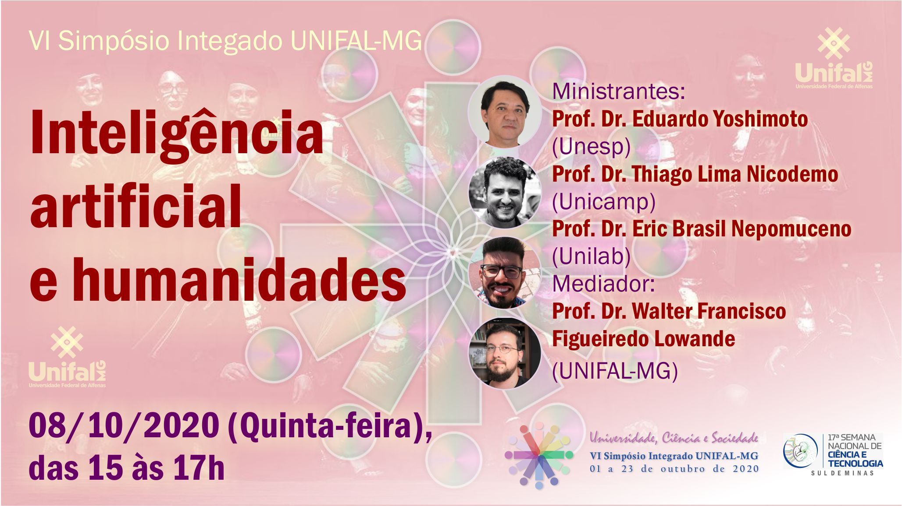

### Módulo 1: Definições, limites e possibilidades do campo das Humanidades digitais

#### Formulário de apresentação e enquete

**Data:** 24/08/2020  até 01/09/2020

**Tipo**: Assíncrona

**CH**: 1 hora

**Plataforma**: `Google Formulários`

***[LINK PARA O FORMULÁRIO](https://forms.gle/q8HTxbKWHTi9yzKK8){:target="_blank"}.***

***

#### Aula 01

**Data:** 25/08/2020

**Tema:** _Apresentação + Conceitos e história_

**Tipo**: Síncrona

**CH**: 1 hora

**Plataforma**: `Google Meet` ***O link para a sala virtual será enviado para os e-mails cadastrados no Sigaa***

| Objetivos           | Conteúdos         |
|:--------------------|:------------------|
| Apresentar o curso  | Estrutura, atividades, etc |
| Caracterizar o campo das humanidades digitais | - Breve apresentação dos conceitos de tecnologia e humanidades digitais |
|Avaliar os desafios metodológicos das ferramentas digitais na pesquisa das humanidades. | Métodos e ferramentas e seu impacto na epistemologia das humanidades.

***

#### Leitura 1

**Tipo**: Assíncrona

**CH**: 4 horas

**Bibliografia**

- TELLES, H. V. História Digital, Sociologia Digital e Humanidades Digitais: Algumas questões metodológicas. _Revista Observatório_, v. 3, n. 5, p. 74, 1 ago. 2017. ([Link original - vários formatos](https://sistemas.uft.edu.br/periodicos/index.php/observatorio/article/view/3810){:target="_blank"} - [link direto - pdf](textos/20170801.pdf){:target="_blank"}).

- VERASZTO, E. V.; SILVA, D. DA; MIRANDA, N. A.; SIMON, F. O. Tecnologia: buscando uma definição para o conceito. _PRISMA.COM_, v. 0, n. 8, p. 19–46, 5 abr. 2009. ([Link original](http://ojs.letras.up.pt/index.php/prismacom/article/view/2065/1901){:target="_blank"} - [link direto - pdf](textos/2065-4533-1-PB.pdf){:target="_blank"}).

***

#### Atividade 1

**Tema:** _Recursos digitais na graduação_

**Tipo**: Assíncrona

**CH**: 2 horas

**Valor**: 2,5 pontos

**Plataforma**: `Google Formulários`

**Entrega**: ***08/09/2020***

**Descrição**: _Preencha o formulário sobre seus hábitos de acesso, acompanhamento de cursos, pesquisa e produção acadêmica._

***[LINK PARA O FORMULÁRIO](https://forms.gle/J5DrqU3jHGaDYaWKA){:target="_blank"}.***

***

#### Plantão 1

**Data:** 28/08/2020

**Tema:** _Dúvidas do primeiro módulo_

**Tipo**: Síncrona

**CH**: 30 min

**Plataforma**: `Google Meet`

***

#### Vídeo 1

**Tema:** _Quem tem medo dos métodos digitais de pesquisa?_, Congresso Virtual da UFBA 2020

**Tipo**: Assíncrona

**CH**: 2 horas

{:target="_blank"}

***

### Módulo 2: Levantamento e gerenciamento bibliográfico

#### Aula 2

**Data:** 01/09/2020

**Tema:** _Gerenciamento Bibliográfico on-line_

**Tipo**: Síncrona

**CH**: 1 hora

**Plataforma**: `Google Meet`

| Objetivos           | Conteúdos         |
|:--------------------|:------------------|
|Desenvolver competências técnicas para a realização de gerenciamento bibliográfico on-line | - Apresenteção de diferentes ferramentes e suas funções na pesquisa;   - Apresentação e instalação do Zotero. |

***

#### Leitura 2

**Tipo**: Assíncrona

**CH**: 2 horas

**Bibliografia**:

- YAMAKAWA, E. K.; KUBOTA, F. I.; BEUREN, F. H.; SCALVENZI, L.; MIGUEL, P. A. C. Comparativo dos softwares de gerenciamento de referências bibliográficas: Mendeley, EndNote e Zotero. _Transinformação_, v. 26, n. 2, p. 167–176, ago. 2014. ([Link original](https://www.scielo.br/scielo.php?script=sci_arttext&pid=S0103-37862014000200167&lng=pt&tlng=pt){:target="_blank"} - [link direto - pdf](textos/0103-3786.pdf){:target="_blank"}).

***

#### Aula 3

**Data:** 08/09/2020

**Tema:** _Oficina de Zotero_

**Tipo**: Síncrona

**CH**: 1 hora

**Plataforma**: `Google Meet`

| Objetivos           | Conteúdos         |
|:--------------------|:------------------|
|Desenvolver competências técnicas para a realização de gerenciamento bibliográfico on-line com Zotero | - Usos e integração do Zotero. |

**Apresentação**: [Clique aqui!](aula3-zotero.md){:target="_blank"}

***

Material de Apoio

**Zotero do Zero**: ***Tutorial de instalação do Zotero***

{:target="_blank"}

**Workshop de Zotero**: usos básicos

{:target="_blank"}

***

#### Atividade 2

**Tema:** _Exercício de Zotero_

**Tipo**: Assíncrona

**Valor**: 2,5 pontos

**CH**: 4 horas

**Entrega**: **27/09** via SIGAA

**Descrição**: Acesse a [página](atividade2-zotero.md){:target="_blank"} ou baixe o [PDF](atividade2-zotero.pdf){:target="_blank"} com as informações da tarefa;

***

#### Vídeo 2

**Tema:** _Capacitação para uso do Zotero_, Biblioteca da UDESC

**Tipo**: Assíncrona

**CH**: 2 horas

{:target="_blank"}

***

#### Aula 4

**Data:** 15/09/2020

**Tema:** _Levantamento bibliográfico on-line_

**Tipo**: Síncrona

**CH**: 1 hora

**Plataforma**: `Google Meet`

| Objetivos           | Conteúdos         |
|:--------------------|:------------------|
|Desenvolver competências teórico-metodológicas para a realização de levantamento bibliográfico on-line | - Reflexão sobre a busca on-line e os impactos na pesquisa;  - Listar e avaliar caminhos para a busca on-line;  - Apresentação e uso do Google Acadêmico. |

**Apresentação**: [Clique aqui!](aula4-lev-biblio.md){:target="_blank"}

***

#### Leitura 3

**Tipo**: Assíncrona

**CH**: 2 horas

**Bibliografia**

- RONDINELLI, R. C. O conceito de documento arquivístico diante da realidade digital. IN: **O documento arquivístico ante a realidade digital**: uma revisão conceitual necessária. Rio de Janeiro: FGV, 2013. (link direto - pdf _em breve_).
- KEMMAN, M.; KLEPPE, M.; SCAGLIOLA, S. Just Google It - Digital Research Practices of Humanities Scholars. In: Clare Mills, Michael Pidd and Esther Ward (orgs.). **Proceedings of the Digital Humanities Congress 2012**: Studies in the Digital Humanities. Sheffield: HRI Online Publications, 2014. ([Link original](https://arxiv.org/abs/1309.2434){:target="_blank"} - [link direto - pdf](textos/Just-Google-It.pdf){:target="_blank"}).

***

#### Plantão 2

**Data:** 18/09/20

**Tema:** _Dúvidas sobre Levantamento Bibliográfico_

**Tipo**: Síncrona

**CH**: 1h

**Plataforma**: `Google Meet`

***

#### Atividade 3

**Tema:** _Google Acadêmico + Zotero + Editor de Texto = Bibliografia_

**Tipo**: Assíncrona

**Valor**: 2,5 pontos

**CH**: 6 horas

**Entrega**: **06/10/2020** via Sigaa.

**Descrição**: Acesse a [página](atividade3-zotero.md){:target="_blank"} ou baixe o [PDF](atividade3-zotero.pdf){:target="_blank"} com as informações da tarefa;

***

***

### Módulo 3: Arquivos, Acervos e Bibliotecas virtuais

#### Aula 5

**Data:** 22/09/2020

**Tema:** _Acessando fontes on-line: o caso da Hemeroteca Digital Brasileira – Biblioteca Nacional_

**Tipo**: Síncrona

**CH**: 1 hora

**Plataforma**: `Google Meet`

| Objetivos           | Conteúdos         |
|:--------------------|:------------------|
|Discutir a elaboração, manutenção, acesso e preservação de coleções, repositórios e plataformas on-line de fontes históricas | - Apresentar e usar a [Hemeroteca Digital Brasileira](http://memoria.bn.br/hdb/periodico.aspx){:target="_blank"}. |

**Apresentação**: [Clique aqui!](aula5-HDB.html){:target="_blank"}

***

#### Leitura 4

**Tipo**: Assíncrona

**CH**: 4 horas

**Bibliografia**

- BRASIL, E.; NASCIMENTO, L. F. História digital: reflexões a partir da Hemeroteca Digital Brasileira e do uso de CAQDAS na reelaboração da pesquisa histórica. _Revista Estudos Históricos_, v. 33, n. 69, p. 196–219, 1 jan. 2020. ([Link original](http://bibliotecadigital.fgv.br/ojs/index.php/reh/article/view/79933){:target="_blank"} - [link direto - pdf](textos/História-Digital-REH.pdf){:target="_blank"}).

***

#### Vídeo complementar - módulo 3

**Tema:** _LIVES DA BN - Ferramentas online: a Hemeroteca Digital Brasileira_

**Tipo**: Assíncrona

**CH**: 2 horas

{:target="_blank"}

***

#### Exercício prático - módulo 3

**Tema:** _Usando a HDB_

**Tipo**: Assíncrona

**CH**: 2 horas

**Descrição**: Acesse a [página](ex_hdb.md){:target="_blank"} ou baixe o [PDF](ex_hdb.pdf){:target="_blank"} com as informações da tarefa;

***

#### Plantão 3 - ADIADO

**Data:** 25/09/2020

**Tema:** _Dúvidas sobre Acervos e repositórios de fontes on-line_

**Tipo**: Síncrona

**CH**: 30 min

**Plataforma**: `Google Meet`

***

***

### Módulo 4: Programação, Algoritmos e a “Sociedade Digital”

#### Aula 06

**Data:** 29/09/2020

**Tema:** _Linguagem de Programação e algoritmos: uma introdução_

**Tipo**: Síncrona

**CH**: 1 hora

**Plataforma**: `Google Meet`

| Objetivos           | Conteúdos         |
|:--------------------|:------------------|
| Desenvolver competências teórico-metodológicas e técnicas para utilização de ferramentas digitais na pesquisa | - Apresentação à raspagem de dados (web scraping) com Python 3 e BeautifulSoup4 |

**Apresentação**: [Clique aqui!](aula6-python.html){:target="_blank"}

***

#### Leitura 5

**Tipo**: Assíncrona

**CH**: 4 horas

**Bibliografia - Algoritmos**

- BIRHANE, A. Algorithmic Colonization of Africa. SCRIPTed, v. 17, n. 2, p. 389–409, 6 ago. 2020. ([Link original](https://script-ed.org/article/algorithmic-colonization-of-africa/){:target="_blank"} - [link direto-pdf](textos/Birhane.pdf){:target="_blank"}, [link para versão em português](textos/ComunidadesAlgoritmoseAtivismos-olharesafrodiasporicos.pdf){:target="_blank"}).
- SILVA, T. Racismo Algorítmico em plataformas digitais: microagressões e discriminação em código. In: SILVA, T (org.). **Comunidades, Algoritmos e Ativismos Digitais**: Olhares Afrodiaspóricos. São Paulo: LiteraRUA, 2020.
([link direto-pdf](textos/ComunidadesAlgoritmoseAtivismos-olharesafrodiasporicos.pdf){:target="_blank"}).

**Bibliografia - Programação e raspagem**

- KARTHIKEYAN T.; SEKARAN, K.; RANJITH D.; VINOTH KUMAR V.; BALAJEE J M. Personalized Content Extraction and Text Classification Using Effective Web Scraping Techniques: International Journal of Web Portals, v. 11, n. 2, p. 41–52, jul. 2019. ([Link original](https://www.igi-global.com/gateway/article/240663){:target="_blank"} - [link direto-pdf](textos/10.4018.pdf){:target="_blank"}).
- MARRES, N.; WELTEVREDE, E. Scraping the Social? Journal of Cultural Economy, v. 6, n. 3, p. 313–335, 1 ago. 2013. ([Link original](https://www.tandfonline.com/doi/abs/10.1080/17530350.2013.772070){:target="_blank"} - [link direto-pdf](textos/Scraping-the-Social.pdf){:target="_blank"}).
- WIERINGA, J. Intro to Beautiful Soup. _Programming Historian_, 30 dez. 2012. ([Link](https://programminghistorian.org/en/lessons/intro-to-beautiful-soup){:target="_blank"}).

***

#### Vídeo 3

**Tema:** _Oficina Web scraping com Python_, LABHD-UFBA

**Tipo**: Assíncrona

**CH**: 2 horas

{:target="_blank"}

***

#### Vídeo 4

**Tema:** _Tecnologia, Raça e Gênero_

**Tipo**: Assíncrona

**CH**: 2 horas

{:target="_blank"}

***

#### Plantão 4

**Data:** 02/10/2020

**Tema:** _Dúvidas sobre o módulo e atividade final_

**Tipo**: Síncrona

**CH**: 1 hora

**Plataforma**: `Google Meet`

***

#### Evento - Mesa no _Simpósio Integrado UNIFAL-MG 2020: Universidade, ciência e sociedade_

**Data:** 08/10/2020

**Horário:** 15h - 17h

**Tema:** _Inteligência artificial e humanidades_

**Tipo**: Síncrona

**CH**: 2 horas

**Plataforma**: Canal do [YouTube da Unifal](https://www.youtube.com/unifalmgoficial)

***

#### Atividade 4

**Tema:** _Programação, algoritmos e pesquisa_

**Tipo**: Assíncrona

**Valor**: 2,5 pontos

**CH**: 6 horas

**Entrega**: **23/10/2021** via Sigaa

**Descrição**: Acesse a [página](atividade4.md){:target="_blank"} ou baixe o [PDF](atividade4.pdf){:target="_blank"} com as informações da tarefa.

***

***

### Módulo 5: OCR - Reconhecimento ótico de caracteres

#### Aula 07

**Data:** 13/10/2020

**Tema:** Workshop de **gImageReader**

**Tipo**: Síncrona

**CH**: 2 hora

**Plataforma**: `Google Meet`

| Objetivos           | Conteúdos         |
|:--------------------|:------------------|
| Reflexões e usos de programas de OCR para a pesquisa em humanidades | Workshop de gImageReader |

***

**Tutorial do gImageReader**:

{:target="_blank"}

***

#### Exercício prático - módulo 5

**Tema:** _A definir_

**Tipo**: Assíncrona

**CH**: 2 horas

**Entrega**: -

**Descrição**: _em breve_

***

***

## Bibliografia

### Bibliografia Básica

CHARTIER, R. **A Aventura do Livro**: Do leitor ao navegador. São Paulo: Editora da UNESP, 1988.

RONDINELLI, R. C. **O documento arquivístico ante a realidade digital**: uma revisão conceitual necessária. Rio de Janeiro: FGV, 2013.

SILVA, T. (org). **Comunidades, Algoritmos e Ativismos Digitais**: Olhares Afrodiaspóricos. São Paulo: LiteraRUA, 2020.

ALVES, P. C.; NASCIMENTO, L. F (orgs.) **Novas fronteiras metodológicas nas ciências sociais**. Salvador: EDUFBA, 2018.

### Bibliografia complementar

FIORMONTE, D.; NUMERICO, T.; TOMASI, F. **The digital humanist**: a critical inquiry. Brooklyn: punctum books, 2015.

LOSH, E.; WERNIMONT, J. **Bodies of Information**: Intersectional Feminism and the Digital Humanities. Minneapolis: University of Minnesota Press, 2019.

LUPTON, D. **Digital Sociology**. Londres & New York: Routledge, 2014.

NOBLE, S. U. **Algorithms of oppression**: data discrimination in the age of Google. New York: New York University Pres, 2018.

ROSENZWEIG, R. **Clio Wired**: The Future of the Past in the Digital Age. New York: Columbia University Press, 2011.

### Bibliografia Suplementar

ALVES, D. As Humanidades Digitais como uma comunidade de práticas dentro do formalismo académico: dos exemplos internacionais ao caso português. _Ler História_, n. 69, p. 91–103, 30 dez. 2016.

BIRHANE, A. Algorithmic Colonization of Africa. _SCRIPTed_, v. 17, n. 2, p. 389–409, 6 ago. 2020.

BRASIL, E.; NASCIMENTO, L. F. História digital: reflexões a partir da Hemeroteca Digital Brasileira e do uso de CAQDAS na reelaboração da pesquisa histórica. _Revista Estudos Históricos_, v. 33, n. 69, p. 196–219, 1 jan. 2020.

DALBELLO, M. A genealogy of digital humanities. _Journal of Documentation_, v. 67, n. 3, p. 480–506, 26 abr. 2011.

LUCCHESI, A. **Digital history e Storiografia digitale : estudo comparado sobre a escrita da história no tempo presente (2001-2011)**. Mestrado. Rio de Janeiro: UFRJ, 2014.

NASCIMENTO, L. F. Combinando webscraping em R e ATLAS.ti na pesquisa em ciências sociais: as possibilidades e desafios da sociologia digital. _18o Congresso Brasileiro de Sociologia_, 2017.

ROMEIN, C. A.; KEMMAN, M.; BIRKHOLZ, J. M.; BAKER, J.; DE GRUIJTER, M.; MEROÑO‐PEÑUELA, A.; RIES, T.; ROS, R.; SCAGLIOLA, S. State of the Field: Digital History. _History_, v. 105, n. 365, p. 291–312, abr. 2020.

YAMAKAWA, E. K.; KUBOTA, F. I.; BEUREN, F. H.; SCALVENZI, L.; MIGUEL, P. A. C. Comparativo dos softwares de gerenciamento de referências bibliográficas: Mendeley, EndNote e Zotero. _Transinformação_, v. 26, n. 2, p. 167–176, ago. 2014

## Vídeos

1. [Quem tem medo dos métodos digitais de pesquisa?](https://www.youtube.com/watch?v=x-SGWbuYTZQ&t=1374s){:target="_blank"}, Congresso virtual da UFBA 2020.
2. [Capacitação: Gerenciador de referência Zotero](https://www.youtube.com/watch?v=aJnKjsFCva0){:target="_blank"}, Biblioteca Universitária UDESC.
3. [Ferramenta de Webscraping para o site da ANPUH](https://www.youtube.com/watch?v=-6IGMyw7c6E&t=26s){:target="_blank"}, Oficina do LABHD-UFBA.
4. [Tecnologia, Sociedade e Gênero](https://www.youtube.com/watch?v=J3OGleaBZWA){:target="_blank"}, painel temático SOLTEC/UFRJ.

***